# Composer

## インストールの手順

### 前提条件  

XAMPPもしくはPHPがインストールされていること

### ダウンロード

下記サイトからComposerをダウンロードする  
https://getcomposer.org/

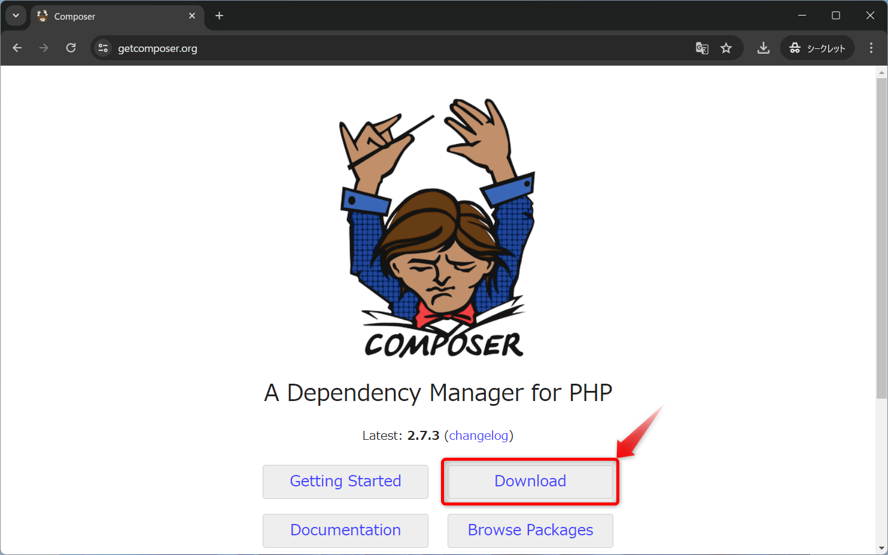  
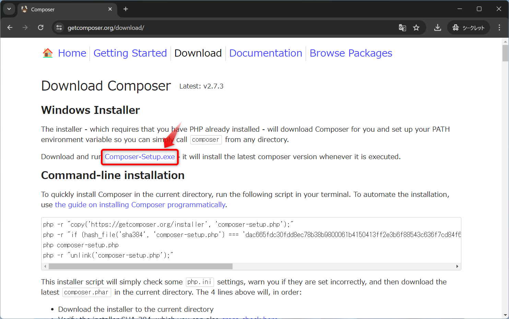

`ダウンロード`フォルダに保存する  
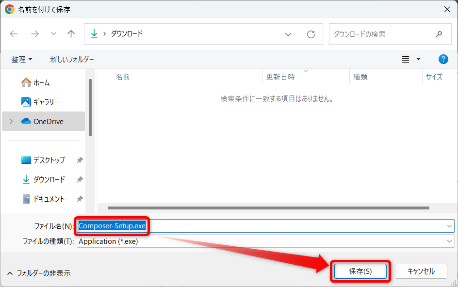

### インストール

ダウンロードしたファイルを実行  
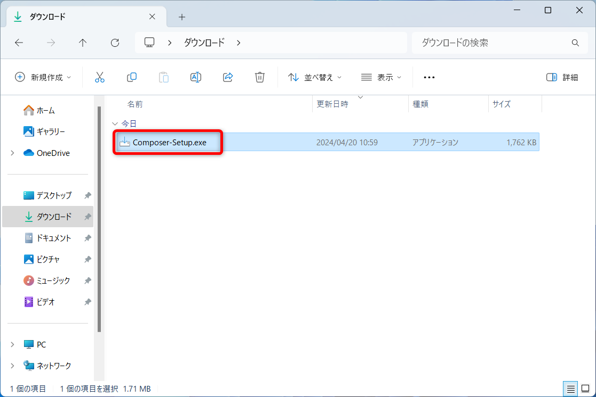

`Install for me only`をクリック  
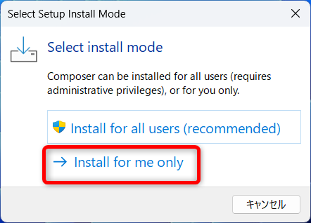

`Next`をクリック  
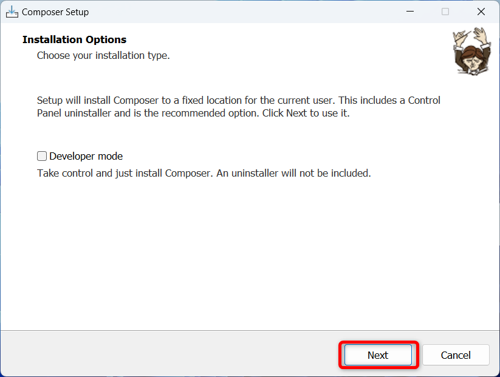

`Next`をクリック  
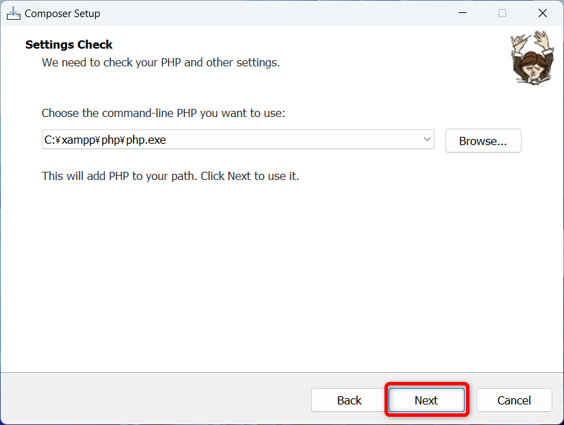

`Next`をクリック  
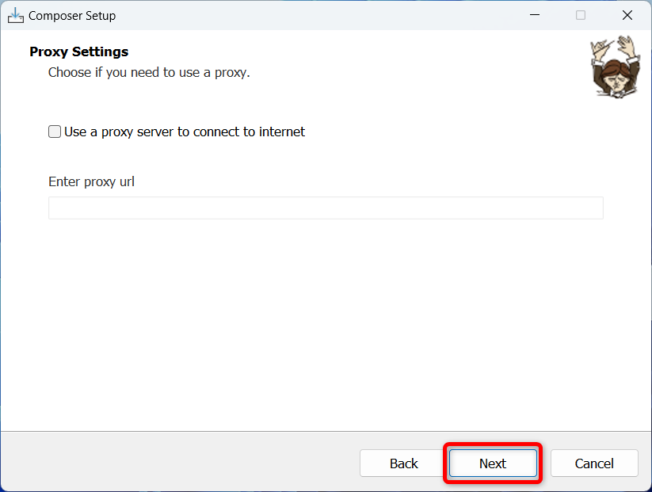

`Install`をクリック  
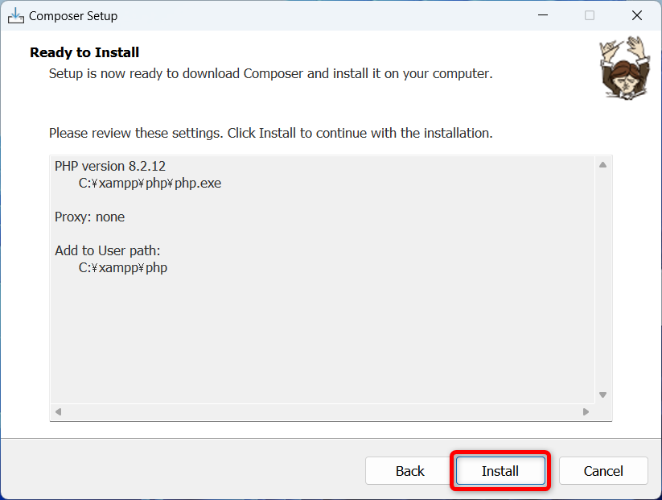

インストールされるので待つ  
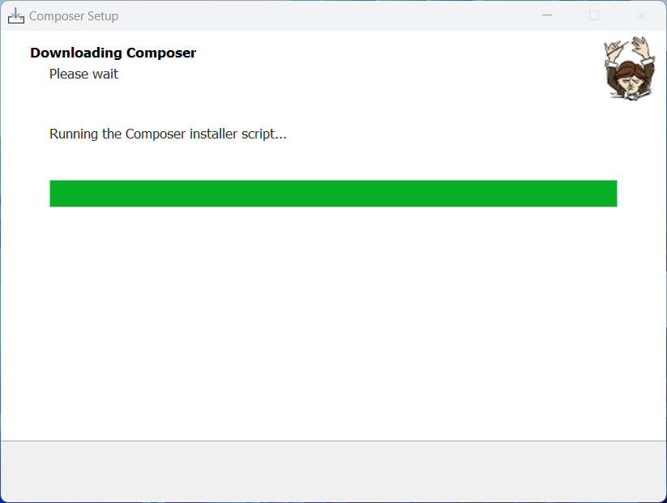

`Next`をクリック  
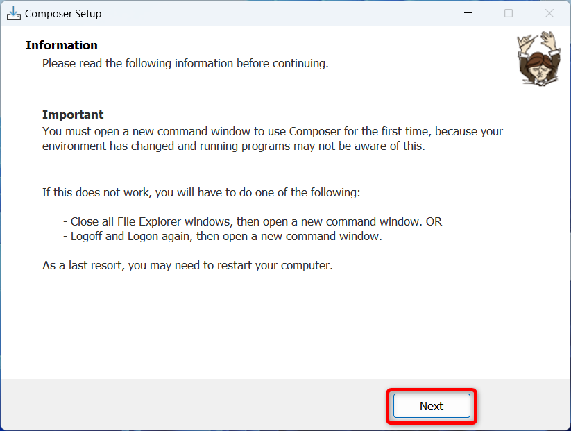

`Finish`をクリック  
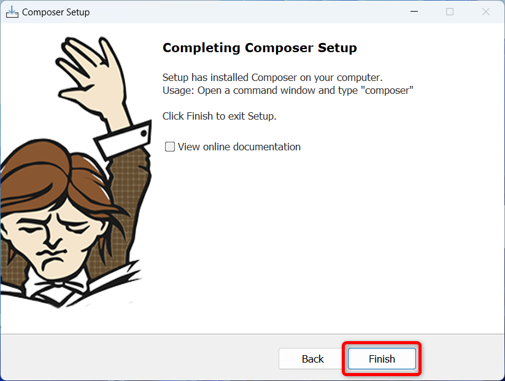

## インストールの確認

コマンドプロンプトを起動して、下記コマンドを実行して
バージョンが表示されたらインストール成功

```bash
composer --version
```

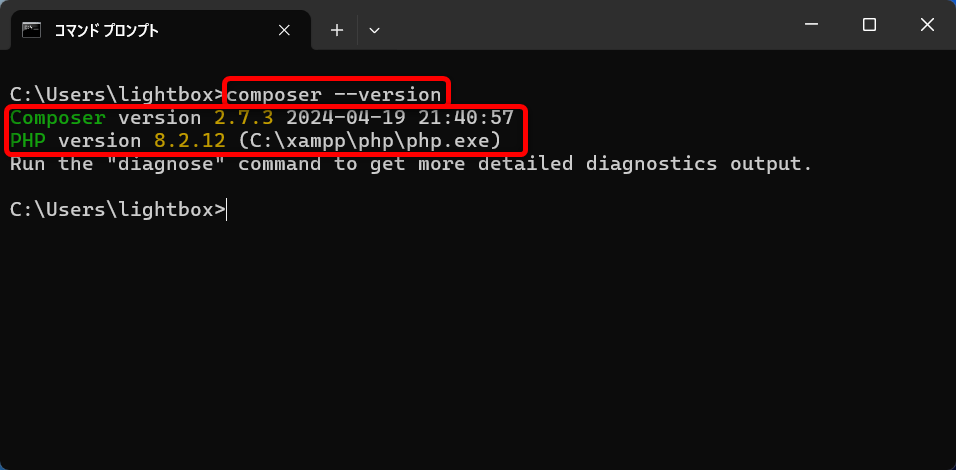

